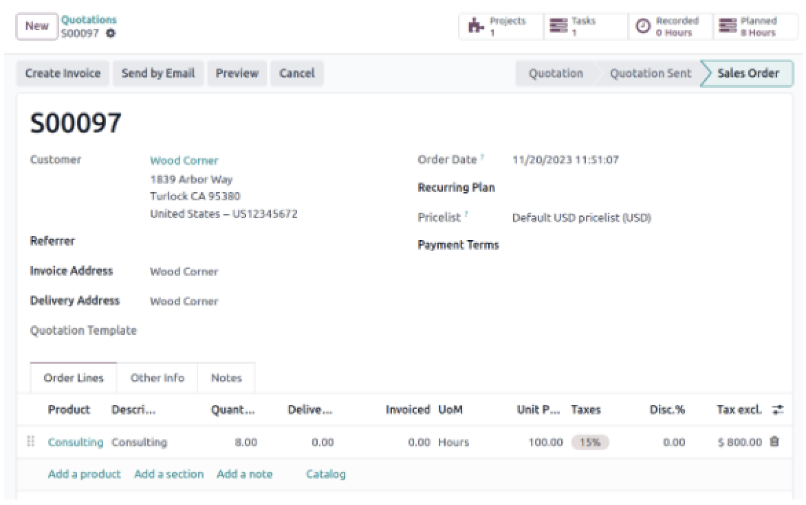

Introduction
=========================

- How many languages can be installed in an Odoo database?

  - Only one at a time
  - Multiple languages can be installed; there is no limit
  - Only a maximum of 3 languages can be installed and then the subscription needs to be modified

- What keyboard shortcut should be pressed to reveal the command pallet in Odoo?

  - CTRL-K (Windows/Linux) or 96 Command-K (macOs)
  - ALT-K (Windows) or CONTROL-K (macOS)
  - There are no shortcuts in Odoo everything needs to be completed through the GUI.

- Can Odoo be used on a mobile device?

  - Yes! Odoo has an Android and iOS app and Odoo's website can also be accessed via mobile devices
  - Yes! Only via the website on Zebra devices for Barcode
  - No

- Any user with 'Access Rights' permissions can install applications and modules?

  - No, only Odoo can install applications and modules for customers
  - No, a user with 'Administration: Access Rights' permissions cannot install an application(s) or a module(s) in Odoo, but they can send a request to activate the app/module to users that have the 'Administration: Settings' permissions
  - Yes, a user with 'Access Rights' permissions can install applications and modules in

- What is the solid round icon in the top right and it's functionality?
- 
  - The solid round icon records all actions within the database. It turns from tan to green when activated
  - The solid round icon indicates superuser has been activated
  - The solid round icon is a button that starts a timer to keep track of hours worked for the day and links to the Attendances app. Location and IP addresses are

- What is necessary in order to send a WhatsApp message from the
  - A Meta approved WhatsApp template synced to the database and a linked WhatsApp business account with a valid payment method attached
  - Odoo WhatsApp IAP tokens are required to send WhatsApp messages from the database in addition to a linked WhatsApp business account
  - Only a linked WhatsApp account is needed, messages can be sent with or without pre-configured templates, once the API and Webhooks are configured

Website
=========================

- You've customized a building block. Can you re-use it?

  - Yes, you can save it and re-use it anywhere on your website
  - No
  - Yes, but only with the HTML/CSS editor

- The colors of the shape are dynamic if adapt?

  - Yes
  - No
  - Yes, but you have to remove the shape and then re-apply it
  

- How can you add the 'customizable cookie bar' for your website visitors?
  
  - By clicking on 'customize' while visiting the home page
  - By enabling the feature in the website settings
  - It's not possible to add a cookies bar for visitors

- How can you superimpose two images?
  
  - By activating the 'grid' mode on the block, adding an image, and dragging it over a second image
  - By clicking on an image, click the 'superimpose' button and add a second image
  - It's not possible to do it

- On what support can you decide to hide certain content blocks when editing your website?
  
  - Desktop
  - Desktop and mobile
  - Desktop, mobile, and tablet

eCommerce
=========================

- Is it possible to set a custom internal reference for each product variant?
  
  - Yes
  - No

- If you wanted to show your customers additional products they may be interested in upon checkout, which feature would you use?
  
  - Alternative products
  - Optional products
  - Accessory products

- Can you edit how variant selection will be displayed on a website product page?
  
  - Yes, by changing the attribute display type in the customize tab in the frontend
  - Yes, by changing the attribute display type in the style tab in the frontend

- How can you allow customers to pay in person at your store (s)?

  - By enabling the "Pay in Store" payment provider
  - By enabling the 'On-Site Payments & Picking' feature, creating a picking site, and enabling the 'Pay in Store' payment provider
  - By enabling the 'Click & Collect' feature, and then creating a new payment method
  - By enabling the 'On-Site Payments & Picking' feature and enabling the 'Pay in Store' payment provider

- You're a wholesaler whose product price changes according to your customer AND the quantity. How can you prevent people from buying published products on your eCommerce and make sure they contact you each time a new customer wants to don oant to have mutile course, you pricelists to handle.

  - You can't do that with Odoo. Your only option is to use multiple pricelists and hope everything goes well
  - You can do so using the 'Extra Step During Payment' feature. With it, customers will have to give their contact details, and they can be contacted later for further discussion
  - You can use the 'Prevent Sale of Zero Priced Product' feature. With it, each product set with a price of 0 will be unavailable for buying. The 'buy' button will be replaced with the 'contact us' button, and potential customers will have to discuss the price directly with you

Survey
=========================
- Which of the following question types don't exist in Odoo Surveys?

  - File upload
  - Datetime
  - Multiple choice: multiple answers allowed

- What happens if this is clicked?

- 

  - Only see survey results from participants who shared the same answer to this particular question
  - Only see portions of the participants who didn't select this answer
  - Odoo redirects to the Participants page for more detailed data

- In the 'Options' tab of a survey form, what are the 'Display Progress as' options?

  - 'Percentage left' and 'Progress bar'
  - 'Percentage left' and 'Number'
  - 'Progress bar' and 'Number'

Knowledge
=========================

- Can Marc Demo read this article?

- 

  - Yes because the default access is: Can Read
  - Yes because the Visibility is set on: Everyone
  - No, because Marc has been set as having 'No Access'

- Which article does Knowledge open when I open the app?

  - The last article I edited
  - The first article of my menu
  - The last article I read

- What are the conditions to be able to use Property Fields?

  - I need the Studio application installed
  - I need a parent article
  - I need to activate it in the settings

Marketing
=========================

- Kanban stages in Odoo Events...

  - ...can never be changed once your first event is created
  - ...can ONLY be changed with the help of a developer
  - ...can ALWAYS be changed 'on the fly' to fit your organizational needs

- Can you use the same mailing list for BOTH email and SMS marketing mailings?

  - Yes, but both mailings must include the very same content
  - Yes, since a mailing list is a list of recipients contains both email addresses and phone numbers

- Marketing campaigns...

  - ...are used to centralize (and report on) marketing efforts revolving around a central topic
  - ...are used to electronically spam random email addresses without any direction or specific intent
  - ...are a series of checklists marketers must complete before sending any communications

- While creating a mailing template, in the 'Mail Body' tab, what's found under the 'Design' tab in the right sidebar?

  - Various design options for elements like headings, links, buttons, and more
  - A blank field to add a custom 'Reply To' email address for this particular campaign
  - There is no 'Design' tab in the sidebar

- In Marketing Automation, which of the following is NOT a Child Activity option?

  - Not Opened
  - Signed Up
  - Bounced

CRM
=========================

- You want to add a new contact to a company. The new contact has a different address from the company. What should you do?

  - On the company's contact record, under the 'Contacts & Addresses' tab. add a new contact with 'Other Addres' specified
  - On the company's contact record, under the 'Sales & Purchase' tab, add a new contact with the 'Follow-up Address' type specified
  - Create a new contact record with the new desired address filled in before linking it to the parent company record

- In the image below, what will be the deadline for the next activity called 'Reminder' if you mark the 'Call' activity as done today?

- 
  - 3 days from today
  - 5 days from today
  - 7 days from today

- What is the visual impact of setting a high priority on an opportunity?

  - The opportunity will move to the top of the stage (in the Kanban view) next time the CRM pipeline page is loaded
  - The opportunity will move to the next page
  - The opportunity label is highlighted in the Kanban view

- When can you configure the 'Lost Reasons' you want your Sales Team to use?

  - They are created when the application is installed and can never be modified
  - They can only be set up once before creating any opportunity
  - They can be modified by going to Configuration > Lost reasons at any time

  
- A user with the access rights 'User: Own Documents Only' can only work with:

  - The leads if they are in Developer Mode
  - The leads that were created the previous year
  - The leads that are either assigned (or unassigned) to them

- What does the probability field on an opportunity indicate?
  - N/A

- In the image below, the '+' button is used to:
- 

  - Create a tage that will come after the current one
  - Configure the stage
  - Create an opportunity in this stage

- In the image below, clicking on the 'Snooze' button for this particular opportunity will:
- 

  - N/A
  - N/A
  - Set the activity deadline to 7 days from now

  
- In the image below, what does '4 Similar Leads' mean?
- 
  - You already received 4 similar requests for information about these services
  - You already received 4 requests from the same customer that seem related
  - This customer already asked for this same information 4 different times in the past

- Which of the following is NOT a Lead Enrichment option on the CRM Settings page?
  - Enright leads on demand only
  - Enrich leads based on customer behavior
  - Enrich all leads automatically

SALES
=========================

- Which of the following is NOT a 'Routes' option on a product form (under the Inventory) tab?
  - Buy
  - Upsell
  - Dropship Subcontractor on Order

- Which of the following statements is true regaraing te compulation below?
- 
  - Custommers associated with this pricelist will receive a discount of exactly 10% on all products
  - Customers associated with this pricelist will have all prices end in '.90'
  - Customers associated with this pricelist will have all prices end in '.00'

- What does it mean if the forecasted quantity or a storable product is less than the quantity on hand?
  - Nothing, as we do not know the complete history of each product
  - New products are planned to arrive in stock
  - There are more outgoing products planned than incoming products

- A customer is interested in a rather expensive product. The product has a supplier delivery lead time that is LESS than your customer delivery lead time.  You do not sell this product often, due to its expensive nature. With that in mind, what is the best procurement method for you to manage this product effectively?
  - Use the Master Production Schedule tool
  - Configure this product as a 'Consumable' type
  - Set this product route to 'Replenish' on Order (MTO)'

- If yoy confirm a quotation with a storable n/a
  - A draft total invoice can be generated while a delivery order is in the 'Ready' stage
  - The option to generate a draft total invoice is only available after a delivery order has been processed
  - A draft invoice is automatically generated after a delivery has been processed

- What does the below configuration for a storable product imply?
- 
  - When a sales or manufacturing order is confirmed, a RFQ will be generated
  - When a reorderng rule set on the product is triggered, a manuractuning order will be generated
  - When a sales or manufacturing order is confirmed, a manufacturing order will be generated

- When configuring a pricelist with formula rules, when is the surcharge (extra fee) applied during the price computation?
  - Before the discount and the rounding
  - Before the discount, after the rounding
  - After the discount, after the rounding

- What does the below configuration for a storable product imply?
- N/A
  - When a sales or manufacturing order is confirmed, a RFQ will be generated
  - When a reorderng rule set on the product is triggered, a manuractuning order will be generated
  - When a sales or manufacturing order is confirmed, a manufacturing order will be generated

- In the image below, which field would you correct?
- 
  - Product Type - it's not a service
  - Invoicing Policy - it's a fixed service
  - Plan service - to assign an employee

- When would it be most useful to use 'Order Grid Entry' as the sales variant selection type for a product?
  - When clients want their sales orders organized in a grid
  - When salespeople typically recommend specific product variants to clients
  - When salespeople usually create large quotations with many products variants for clients

PURCHASE
=========================

- Where do you define the vendor delivery lead time?
  - On the Product template form, under the Purchase tab, tound on each
  - On the vendor tab
  - On the company

- Where is the costing method defined?
  - On the product
  - on the product category
  - On the company (all products have the same costing method)

- An RFQ is automatically created whenever the following happens:
  - The route on the product is set as 'Buy' and a reordering rule is triggered
  - The route on the product is set as 'Buy' and a sales order is validated
  - The route on the product is set as 'Manufacture' and a quotation is created

- Actualmente tienes 3 unidades de una mesa en stock y una regla de reordenamiento con Min. 5 unidades y Max. 15 unidades y una cantidad múltiplo de 10. ¿Cuál será la información en la RFQ creada por esta regla?

  - Quantity = 20 units 0rce= $420/uni
  - Quantity = 20 units, price = $450/unit
  - Quantity = 13 units, price = $470/unit
  

- A product has a purchase lead time of 15 days and there is a purchase security lead time of 5 days. What will be the scheduled date for the receipt of a purchase order confirmed

  - This will be known at reception only
  - Today +20 days
  - Today +15 days

- When creating an RFQ, which of the following can you NOT use to search for a product?
  - Product name
  - Vendor product code
  - Product Vendor Pricelist

- Which of the following product types CANNOT use reordering rules?
  - Consumable products
  - Service products
  - A & B

- When creating an RFQ, which of the following can you NOT use to search for a product?
  - Product name
  - Vendor product code
  - Product Vendor Pricelist

- When creating a new 'Blanket Order', can you configure the purchase agreement to expire on a specific date?
  - No, a 'Blanket Order' can only be deleted or archived manually after being created
  - Yes, by entering the desired date in the 'Agreement Deadline' field
  - Yes, by changing the 'Expiration Date' of the products included on the individual product forms

- When the '3-way matching' feature is activated, how will you know which vendor bills are ready to be paid for received quantities?

  - Yon won't. The '3-way matching' feature only works when the bill control policy is set to 'On ordered quantities'
  - The 'Should Be Paid' field will read "Yes', under the 'Other Info' tab on the vendor bill
  - When the vendor bill's status changes from 'In Payment' to 'Paid'

PROJECT
=========================

- Is it possible to define different Kanban stages for different projects?
  - No
  - Yes

- Is it possible to create different Kanban stages for tasks within the same project?
  - Yes
  - No

- You can bill time spent by your employees at different rates depending on the project.
  - True
  - False

- Which statement is true? Tasks without a project are visible to:
  - The burndown chart represents the number of tasks that were in each stage at any point in time.
  - True
  - False

- How do you define a template for your project's documents workspace?
  - By defining a workspace template in the settings of Project
  - By defining a workspace template on your service
  - By duplicating a workspace that acts as a template

- What condition(s) must be met for the milestones of your project to be invoiced?

  - A sales order item must be set on the milestone
  - The milestone must be marked as reached
  - All of the above

- Typing 'Office planning!' in a new task title field will:

  - Make it seem like you're yelling
  - Create a task with the title 'Office' and create a priority shift in Planning
  - Create a starred task with the titile 'Office planning'

TIMESHEETS
=========================

- What happens when a sales order, including a product with the following configuration, is validated?
- 
  - A task is created in a new project, and I can invoice the timesheeted (delivered) quantity
  - A task is created in a new project, and I can invoice the ordered quantity ol the sales order at any time
  - A task is created in a new project, and I can invoice the quantity of the sales O order only when the delivered quantity equals ordered quantity

- Is it possible to choose some timesheet lines from the list and invoice them?
  - Yes
  - No

- Why is the 'Delivered' field still empty on this sales order?
- 

  - Because timesheets still need to be encoded and linked to the corresponding sales order
  - The 'Delivered' field is filled when timesheeted hours equal the 'Ordered' quantity on the sales order
  - Only products set as 'Milestone' have the 'Delivered' field populated when timesheeting

- Which statement is true?

  - You can change the sales order item or remove the sales order item in which case the timesheet is considered 'non-billable'")
  - A billable task can contain timesheets that are not billable
  - The timesheets of a billable task can be linked to different sales order items
  - All of the above

- Which statement is false?
  - Employees can no longer create/edit timesheets that are before their most recent validated timesheets.
  - Employees cannot record or edit new timesheets when timesheets from an earlier period have not yet been validated
  - Employees cannot encode/edit timesheets outside their working hours

- Employee billing time target is configured....
  - In HR settings of the individual employee
  - For all employees in Timesheets settings
  - In the Billing Rate Leaderboard

- Which statement is true?
- 
  - On Tuesday, 2 hours were recorded, and 6 hours are missing as per employee's contract
  - On Tuesday, 6 hours were validated, and 2 are missing as per employee's contract
  - On Tuesday, 6 hours were recorded, and 2 are missing as per employee's contract

ACCOUNTING
=========================

- Which of the following depreciation methods does NOT exist in Odoo?
  - Straight line
  - Declining
  - Sum of the years
  - Declining, the straight line

- What kind of actions can you define when using the payment follow-up levels?
  - Send email
  - Send SMS message
  - Send a letter
  - Only email and letter are possible
  - All are possible

- What happens if a currency is not set on an account?
  - The account can be used for transactions in any currency
  - The account can only be used for transactions in the main company currency
  - It’s not possible. A currency is required for each account

- What does It mean When a line Item in the 'Match Existing Entries' section of the bank reconciliation screen is highlighted in blue?
  - It is snowing a registered payment
  - A payment is registered in another currency than the default currency
  - it represents an invoice

- How are total tax amounts rounded on an invoice?
  - 'Globally' based on the untaxed amount of the invoice
  - 'Per line' on each invoice line
  - Either 'globally' or 'per line' as defined in the app's settings
  - Either 'globally' or 'per line' as defined in the invoice's options

- In Odoo Accounting, how can you create a new customer invoice or vendor bill?
  - Manually
  - by uploading a document
  - by sending an emall to an amail alias
  - All or the above

- How many charts of accounts can you have?
  - As many as you'd like
  - One per company
  - One per year
  - One per fiscal position

- In which order should lock dates be set for optimal use of Odoo?
  - First, the Journal Entries Lock Date', then the 'Tax Return Lock Date', and finally, the All Users Lock vate
  - First, the 'Tax Return Lock Date', then the 'Journal Entries Lock Date', and finally, the 'All Users Lock Date'
  - First. the 'All Users Lock Date' then the 'Tax Return Lock Date'. and finally. the 'Journal Entries Lock Date'
  - First, the Journal Entries Lock Date', then the 'All Users Lock Date', and finally. the 'Tax Return Lock Date'

- What information could be used by the document digitization feature to detect
  - n/a

- Is it possible to create early payment discounts in Odoo?
  - No, you need to write off the difference between the invoice and the payment manually
  - Yes, by creating a discount program and selecting it on the invoice
  - Yes, by setting an early discount in a payment terms model and selecting it on the invoice
  - No, discounts can only be granted on sales order lines, not based on payment date

- What changes when enabling the accounting firm mode?
  - The document'e ceauence hecomee editable on all documents
  - A new field « Total (tax inc.) » to speed up and control the encoding by automating line creation with the right account and tax
  - A detault Customer Invoice / Vendor Bill date will be suggested
  - All of the above

- How can the total be spelled out in words on invoices?
  - In the Accounting settings, enable the 'Total amount of invoice in letters' checkbox
  - Open the invoice renort in Studio and drad and dron the 'Total amount of invoice in letter' field onto the report
  - Open the invoice report in Studio, select the 'Total field, and select the 'Amount in letters' widget
  - This is not possible in Odoo

INVENTORY
=========================

- When you perform an 'Inventory Adjustment' for a product and set the quantity to 0, what happens to the forecasted units of that product?
  - Nothing happens 
  - The forecasted inventory is negative and the product shows as "Not  Avallable on any existing sales Orders

- You have 14 units on hand of the product below. If you run the following reordering rule, how many units will be ordered?
- 
  - 0
  - 36
  - 48

- if you update the quantity on hand of a product, does it generate the same stock moves as validating an inventory adjustment for the same product, location, and
  - Yes
  - No

- When purchasing a product, when is the quantity on hand of that product increased?
  - When the purchase order is validated
  - When receipt is validated
  - When the vendor bill is posted

- If you make an inventory adjustment from 5 units to 4 units for a product, what inventory moves are created? A move of l unit trom an Inventory loss location to an Internal locatior
  - A move of 4 units from an internal location to an inventory loss location
  - A move of 1 unit from an internal location to an inventory loss location
  - A move of 1 unit from an inventory loss location to an internal location

- Where is the costing method defined?
  - On the product form
  - On the product category form
  - On the company (Al products have the same costing method)

- Su almacén está configurado para realizar entregas en 3 pasos (recoger-pacar- enviar). Tienes que elegir 10 sillas y 5 escritorios en el primer paso, pero accidentalmente eliges 15 sillas y 2 escritorios. ¿Cuál será el resultado en la operación del paquete?
  - 15 sillas, 2 escritorios.
  - 10 sillas y 5 escritorios (si no se selecciona ningún pedido pendiente al confirmar el picking).
  - 10 sillas, 2 escritorios.

- Which of these picking methods does not require first creating a batch picking?
  - Wave picking
  - cluster picking
  - A & B

- You can create stock moves by: A. Dragging serial numbers to and from locations in kanban view B. Using the 'Relocate' button on the Inventory Adjustments dashboard C. Clicking 'New' on the Moves History dashboard
  - A & B
  - A & C
  - Just C

- The product, bolt, is stored in packages of 10, 30, and 50 units. If a customer places an order for 50 bolts, what removal method minimizes combining smaller packages for the order?
  - FIFO
  - Closest location
  - Least packages

MRP
=========================

- Where do you define the roles of approvals for Engineering Change Orders (ECOs)?
  - On the ECO Stage form
  - on the product form
  - At the ECO type level

- When setting an analytical account on a manufacturing order, how are the various costs accounted for?
  - Produced units are accounted for positively and consumed components are C accounted for negatively
  - Only consumed components and work order costs are accounted for
  - The analytical account does not record any manufacturing costs

- Can you use a kit as a component in a bill of material?
  - Yes
  - No

- Can you work Without a work center?
  - Yes, but not work order will be generated
  - No, defining a work center is mandatory

- What type of quality check should I perform if, during the same operation, various lots of the same product must be tested separately?
  - Uperation quality cneck
  - Quantity type quality check
  - Frouct type cudity check

- What do the additional row options Actual Demand Y-1 and Actual Demand Y-2 refer to in the Master Production Schedule (MPS)?
  - The quantty or products sold at tnis time last year and two years ago, respectively
  - The quantty or products delivered to customer locations at the same time last year and two years ago, respectively
  - The demana torecast Input in the MPs this time last year and two years ago respectively

- In the MPS, what does an orange-colored cell indicate about replenishment?
  - A replenisment order has already been generated, out more quantites need v to be ordered
  - N/A
  - N/A

- Is it possible to determine product specific capacities for work centers?
  - Yes
  - No
  - No, you must create different work centers

- What must happen in order to mark a subcontracted order as complete?
  - The subcontractor must valldate component consumption from the cubcontracting portal
  - The user mus validate the receipt of the product from the subcontractor
  - The finished product must be shipped

  
- For a manufacturing order, where do you find the cost of processing a specific work order?
  - Manufacturing app → Operations → Manufacturing Orders → select MO → Overview → Operations section
  - Manufacturing app → Operations → Manufacturing Orders → select MO → Work Orders tab
  - Manufacturing app → Operations → Work Orders → select work order

- When do you need to click 'Check Availability' on an MO to make it reappear in the Shop Floor module?
  - After adding a component 
  - After repienishing a scrappea componen
  - After replenishing a scrapped component AND adding a component

  
HR
=========================

- Where do you configure Time Off requests to require multiple approvals?
  - On the employee form
  - In the settings of the Time Off app
  - On the Time Off Type form

- N/A
  - When the employee has paid for the expense but has not been reimbursed yet
  - When the employee has paid for the expense and has been reimbursed by the company
  - As soon as the expense has been approved by the company

 
- What will be submitted to your manager for approval when finalizing an expense to be reimbursed?
  -An expense
  -An expense report

- How can you have superheroes on your team?
  - By using the Recruitment app
  - By using the Online Jobs module
  - By using the Referrals app

  
- When adding a product to an Expense report, what type of tax configuration is not compatible?
  - Included in Price
  - Excluded from Price
  - Both are compatible

Spreadsheet
=========================

- Setting up a spreadsheet filter which have the field matching enabled allows you to:
  - Show/hide specific pivots in the spreadsheet
  - Set a filter on every pivot cell of the spreadsheet

- Set formatting rules on pivot cells
  - How can you manually refresh the values of pivot cells?
  - Close and re-open the spreadsheet
  - From the pivot properties panel
  - Both of them

- How can you rank a list coming from Odoo in Spreadsheet?
  - By ranking it when importing it
  - By using the 'Value' filter
  - Both of them

Studio
=========================

- Which one of these relational field types does NOT exist in Odoo?
  - one2one
  - many 2one
  - many 2many

- What does it mean when text is highlighted in blue in the report editor?
  - These elements are highlighted for customer visibility
  - These are placeholders for elements that may vary from one instance of the report to another
  - These elements are conditionally visible

- What happens when you modify the footer of an invoice report?
  - The footer is modified for all invoice reports
  - The footer is modified for all reports within the same model
  - The footer is modified for all reports
